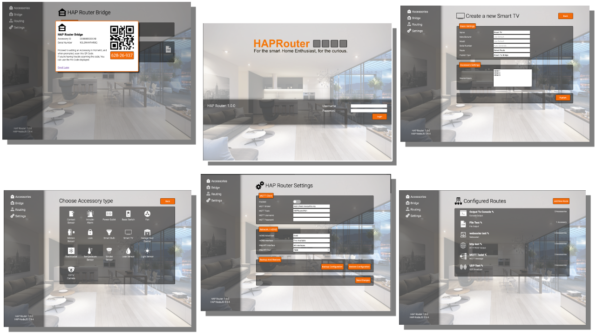

# HAP Router  
  

  

A Middleware HAP Router for bringing HomeKit functionality to your Home Automation.  

HAP Router is a middleware NodeJS server that allows you to take advantage of Apples HomeKit technology, and bring it in to your automation ecosystem.  
This is achieved by creating simple, software based accessories, that can be enrolled into HomeKit.  

The difference however, compared to most implementations of this kind, is that the events that occur on them are directed (or routed) to a transport of your choice.  
These transports can be a UDP broadcast, a message sent to an MQTT broker, sent to Node Red or anything other automation platform.  

The accessories have also been created for you, and you simply select the type of accessory you wish to create  
and set their associated information. 

Transports are the medium, in which the event is travelled. By default, the following transports (or routes) are available:

  - HTTP
  - UDP Broadcast
  - File
  - MQTT
  - Websocket
  - Console (Mainly for testing)

When I say 'by default' - what I mean here, is that you can [develop your own](./RouteModule.md) route modules.  

The transport/route will receive the following JSON payload.  
There are 3 event types: **characteristicUpdate**, **pairStatusUpdate**, **identifyAccessory**

**pairStatusUpdate**
```javascript
{
  accessory: {
    AccessoryID: '8D6497BC70A1',
    AccessoryType: 'Fan',
    AccessoryName: 'My Fan',
    AccessorySerialNumber: '2ND2PB12EQO3',
    Bridged: false
  },
  route: {
    Name: 'Output To Console',
    Type: 'Console Output'
  },
  eventType: 'pairStatusUpdate',
  eventData: true
}
```

**identifyAccessory**
```javascript
{
  accessory: {
    AccessoryID: '8D6497BC70A1',
    AccessoryType: 'Fan',
    AccessoryName: 'My Fan',
    AccessorySerialNumber: '2ND2PB12EQO3',
    Bridged: false
  },
  route: {
    Name: 'Output To Console',
    Type: 'Console Output'
  },
  eventType: 'identifyAccessory',
  eventData: true
}
```

**characteristicUpdate**
```javascript
{
  accessory: {
    AccessoryID: '8D6497BC70A1',
    AccessoryType: 'Fan',
    AccessoryName: 'My Fan',
    AccessorySerialNumber: '2ND2PB12EQO3',
    Bridged: false
  },
  route: {
    Name: 'Output To Console',
    Type: 'Console Output'
  },
  eventType: 'characteristicUpdate',
  eventSource: 'iOS_DEVICE',
  eventData: {
    characteristic: 'RotationSpeed',
    value: 62
  }
}
```

If you're a Home Automation Enthusiast, or just a tinkerer, Hap Router allows you to explore Homekit, and build with it.

## Nice! how do I get started
The server is managed by a gorgeous looking Web User Interface (if the above images haven't already suggested so), It is a breeze to use, and at the basic level you:
 - Create a Route (Routes can be used by more than 1 accessory)
 - Create an Accessory (16 different accessory type thus far)
 - Enroll the device in HomeKit.
 - Have Fun.

Devices can be 'published' in 2 ways:  
 - Attached to a bridge (HAP Router can also act as a Bridge)  
 - Exposed as a seperate device.

 If you have Enrolled HAP Router in your HomeKit environment as a bridge, then any accessories attached to this Bridge, will be seen when published.
 else, you enroll the accessory as a separate entity.

## Manipulating accessories using non apple devices.  
HAP Router has a web based API, as well as an MQTT client built in.  
The web API uses BASIC HTTP Authentication, and the login details are the same as the management UI.

| Method | Address                           | Description                                             |
| ------ | --------------------------------- | ------------------------------------------------------- |       
| GET    | /api/accessories                  | Lists all accessories and there current characteristics |       
| GET    | /api/accessories/{{AccessoryID}}  | Same as above but for the identified accessory          |      
| POST   | /api/accessories/{{AccessoryID}}  | Sets characteristics for the identified accessory       |    

To turn the fan accessory on at full speed, using the web API, you will:  
Send a post request to: **http://{{IP ADDRESS}}:7989/api/accessories/8D6497BC70A1**  
And inlcude the following POST body (with a type of **application/json**)

```javascript
{
  'On': true,
  'RotationSpeed': 100
}
```

If you have enabled the MQTT client in the UI, the same message will be sent.  
Just ensure the the topic of the message ends with the Accessory ID.  
By default the subscribed topic is **HAPRouter/IN/+**


## Command line arguments

| Argument                          | Description                                      |
| --------------------------------- | ------------------------------------------------ | 
| reset                             | Completely resets HAP Router to a default state  |      
| installmodule {{Name}}            | Installs the specified route module from NPM     |    
| passwd {{Username}} {{Password}}  | Set the UI and API login information             |    

## Credits
HAP Router is based on the awesome [HAP-NodeJS](https://github.com/homebridge/HAP-NodeJS)
library, without it, projects like this one are not possible.

## Version History  

  - **1.0.0**
    - Initial Release

## To Do
  - Continue to add more accessory types